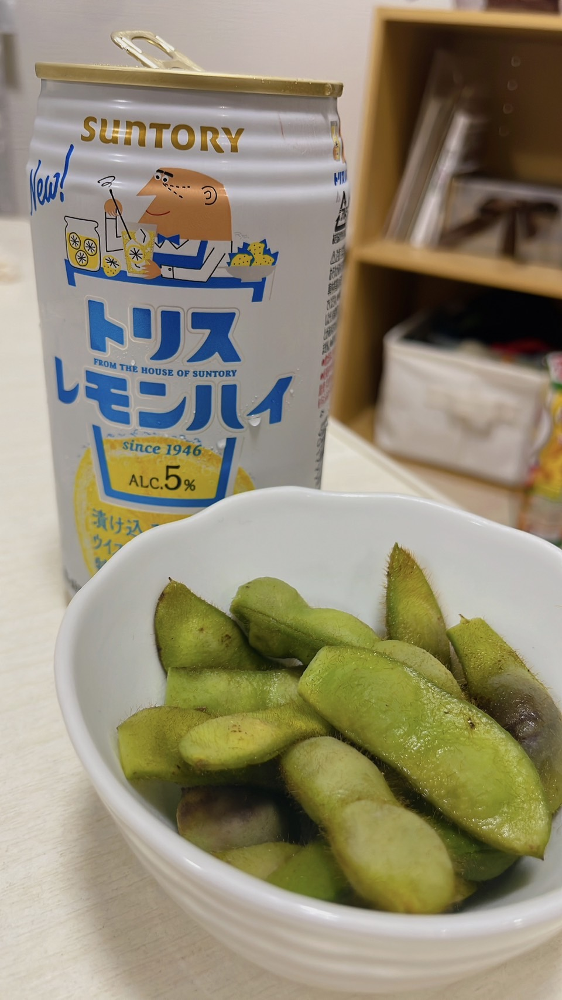

# 自己紹介
### 中山珠英です
佐賀大学農学部国際・地域マネジメントコース③年生です。

**好きな食べ物**  
 　1.　チキン南蛮  
 　2.　チョコレート  
 　3.　アヒージョ  

 **幸せを感じる瞬間**  
 　1.　ご飯を食べるとき  
 　2.　旅行に行くとき  
 　3.　音楽を聴くとき  

 **最近の一枚**  
 農家さんからいただいた枝豆をゆでて、美味しく頂きました。
 